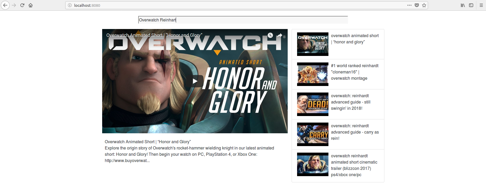

# YouTube Mock React Application

Simple application that uses React, Redux and YouTube's API to create a mock application of youtube.



### Getting Started
```
> git clone https://github.com/xsv24/YoutubeMockReact.git
> cd YoutubeMockReact
> add YouTube API key into './src/index.js'
> npm install
> npm start

```